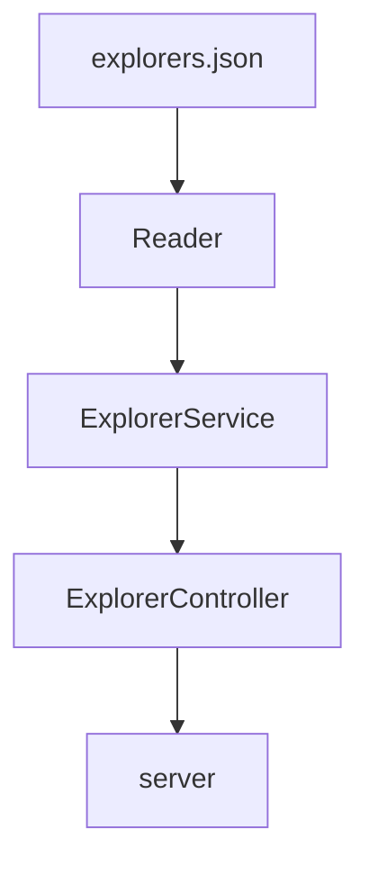

# Fizzbuzz_New_Feature

Este proyecto es una API que consulta a una lista de explorers, donde cada uno esta registrado a una mission en especifico.

Asi igual, cada explorer tiene registrado un score, cuyo valor regresa un mensaje en especifico dependiendo del score. 

## Estructura

